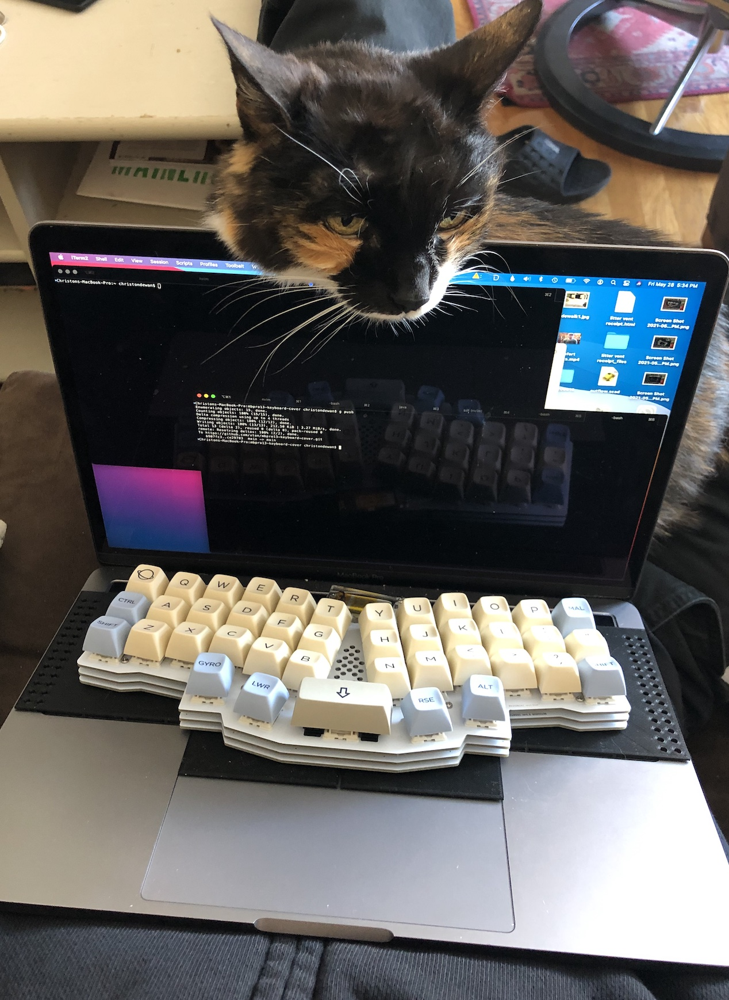
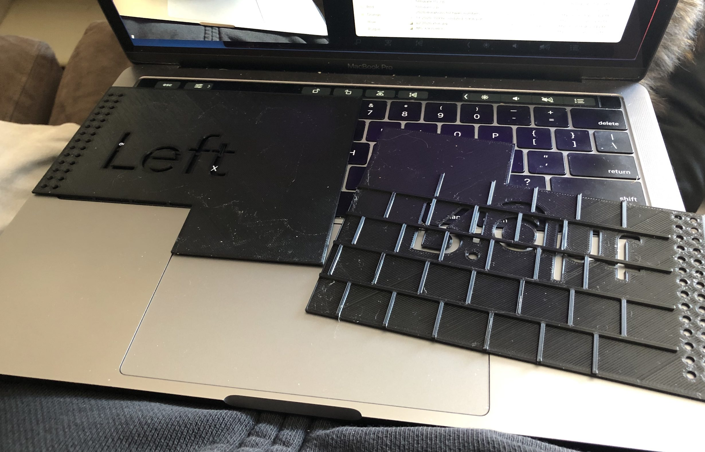

# Macbook Pro 13" Keyboard Cover

3d printed keyboard cover for a macbook pro 13" so you can put your own fancy
mechanical keyboard on top of it.  

This is a remix of [pyrho's design](https://www.thingiverse.com/thing:3798064) (source [here](https://github.com/pyrho/cad/tree/master/macbook-kb-cover))

# Changes from Original

* Adjusted dimensions to fit a 13" macbook instead of 15".
* Square trackpad cover to fit my own keyboard better.
* Ansi instead of ISO. 

# Rebuilding

You only need to do this if you chaneg the design. The `.stl` files in
`resources/` are ready to slice and print as-is. You'll need Clojure,
Leiningen, and OpenSCAD. You can find detailed instructions
[here](https://github.com/adereth/dactyl-keyboard#generating-a-design). Having
gotten those, the tl;dr is:

1. Run `lein repl`
2. Within that, run `(load-file "src/core.clj")`, this will regenerate the `.scad` files in `resources/`.
3. Open the `.scad` files in OpenSCAD. Render them, and export as `.stl`s. 
